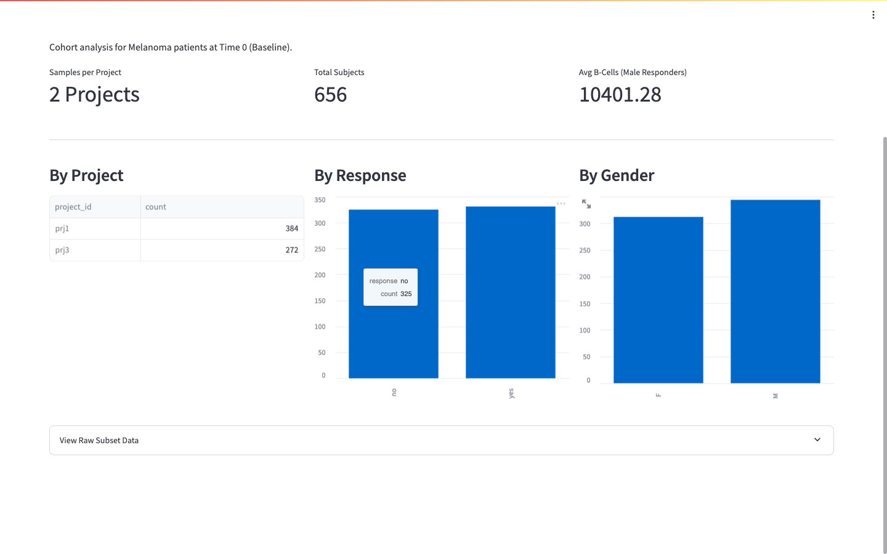

# Immune Cell Clinical Trial Analysis

Production-style analytical pipeline for an immune-cell clinical trial assignment.

This project is structured as a small, maintainable analytics system rather than a single notebook/script. It separates ingestion, domain analysis, statistical testing, and presentation so each layer can evolve independently.

## Business Questions Covered

1. What is the relative frequency of each immune-cell population per sample?
2. For Melanoma + Miraclib + PBMC cohort, do responders and non-responders differ by cell population?
3. For baseline Melanoma/Miraclib/PBMC subset:
   - How many subjects are in each project?
   - What is the response/sex distribution?
   - What is the average B-cell count for male responders?

## Technical Architecture

### Layered design

- `load_data.py` is the ETL entrypoint (CSV -> normalized SQLite schema).
- `src/database.py` owns connection and schema lifecycle.
- `src/analysis.py` owns reusable feature engineering (counts -> percentages).
- `src/statistics.py` owns inferential logic (Mann-Whitney/Welch, FDR, effect sizes).
- `src/queries.py` owns targeted business queries for Part 4.
- `src/reporting.py` owns HTML/PDF report generation.
- `dashboard/app.py` is the UI layer only (no heavy business logic embedded).

This layout keeps concerns isolated, reduces coupling, and supports future extension (e.g., alternate statistical method or alternate front-end).

Scalability note: The normalized schema (3NF) minimizes data redundancy and keeps joins explicit. If this scales to hundreds of projects and millions of rows, the current SQLite model can be migrated to PostgreSQL/Snowflake with minimal changes to the Python analysis layer, while indexes on `project_id`, `subject_id`, and `sample_id` preserve query performance.

## Repository Structure

```text
.
├── cell-count.csv
├── load_data.py
├── run_analysis.py
├── immune_cells.db
├── requirements.txt
├── README.md
├── dashboard/
│   └── app.py
├── docs/
│   └── screenshots/
│       └── dashboard-part4.png
├── src/
│   ├── __init__.py
│   ├── analysis.py
│   ├── config.py
│   ├── database.py
│   ├── queries.py
│   └── statistics.py
└── tests/
    ├── __init__.py
    └── test_basic.py
```

## Data Model

SQLite database: `immune_cells.db`

- `subjects`
  - `subject_pk` (PK), `project_id`, `subject_id`, `condition`, `age`, `sex`, `treatment`, `response`
  - unique key: `(project_id, subject_id)`
- `samples`
  - `sample_id` (PK), `subject_pk` (FK), `visit_time`, `sample_type`
- `cell_counts`
  - `id` (PK), `sample_id` (FK), `cell_type`, `count`

## Statistical Approach

`src/statistics.py` defaults to `scipy.stats.mannwhitneyu` (two-sided) because biological count/frequency data is often non-normal. The default analysis is baseline-only (`visit_time=0`) with subject-level aggregation to reduce repeated-measure pseudoreplication. It also supports Welch's t-test for sensitivity checks, reports BH-FDR adjusted q-values across cell-type hypotheses, and includes effect-size plus directionality context (`effect`, `cliffs_delta`, `direction`, `median_diff`) with bootstrap 95% confidence intervals.

## Setup

### 1) Create and activate a virtual environment (recommended)

macOS/Linux:

```bash
python3 -m venv .venv
source .venv/bin/activate
```

Windows (PowerShell):

```powershell
python -m venv .venv
.\.venv\Scripts\Activate.ps1
```

### 2) Install dependencies

```bash
python3 -m pip install -r requirements.txt
```

### 3) Build the database from CSV

```bash
python3 load_data.py
```

Expected behavior:

- Creates/updates `immune_cells.db`
- Initializes schema
- Loads subjects, samples, and melted cell-count rows

### 4) Run command-line analysis report

```bash
python3 run_analysis.py
```

This script prints:

- Part 2 sample frequency preview
- Part 3 responder vs non-responder statistical summary
- Significant findings interpretation

### 5) Launch interactive dashboard

```bash
streamlit run dashboard/app.py
```

Local dashboard URL: `http://127.0.0.1:8501`

Dashboard tabs:

- `Statistical Analysis (Part 3)`
  - Global filters (condition/treatment/sample type/time)
  - Unit-of-analysis toggle (sample vs subject)
  - Metric toggle (percentage vs count)
  - Optional CLR transform for compositional percentage analysis
  - Mann-Whitney + BH-FDR results table (q-values, effects, group sizes)
  - Interactive Plotly boxplot with q-value annotations
  - CSV export for stats and filtered analysis dataset
  - HTML/PDF report export
- `Subset Analysis (Part 4)`
  - KPI cards (projects, samples, subjects, avg male-responder B-cell)
  - Project/response/sex distributions
  - Cohort flow (sample and subject attrition counts)
  - Raw subset table explorer
- `Sensitivity / Robustness`
  - Scenario matrix comparing significance across test/correction/time settings
- `Methods & Definitions`
  - Explicit methodology and interpretation notes

Dashboard screenshot:



## Verification

Run tests:

```bash
pytest -q
```

Current baseline from this implementation:

- Tests: `5 passed`
- ETL row counts after load:
  - `subjects`: 3500
  - `samples`: 10500
  - `cell_counts`: 52500
- Part 3 default cohort found a significant signal for `cd4_t_cell` (`p ~= 0.0133`)

## Engineering Notes

- Configuration values (paths/cell types) are centralized in `src/config.py`.
- SQL and transformation logic are explicit and reviewable.
- Core domain logic is reusable outside Streamlit (used by both CLI and UI).
- Tests validate analysis/statistics interfaces, subset-count consistency, CLR behavior, and report-export byte generation.

## Potential Next Improvements

1. Add parameterized SQL for all query interfaces and stricter input validation.
2. Add uniqueness guard/constraint for `(sample_id, cell_type)` to prevent accidental duplication.
3. Add subject-level aggregation mode to avoid pseudoreplication in repeated-measure settings.
4. Cache UI computation stages (`st.cache_data`) keyed by filter tuple for scale.
5. Expand test suite with integration checks for Part 4 query semantics.
